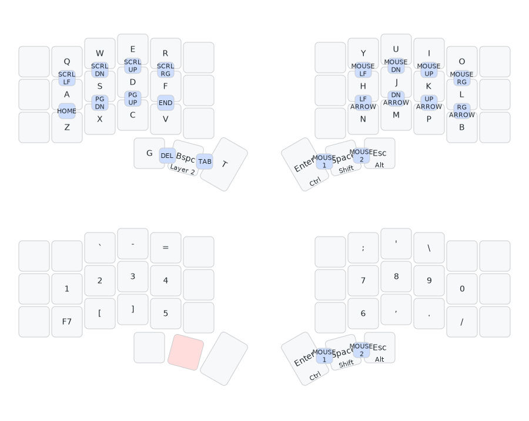

# QMK keymap



https://keymapdb.com/keymaps/godalming123/

## Installation guide

### 1. Install the QMK CLI

#### Linux

- Install [nix](https://nixos.org/download/#download-nix)
- Install QMK CLI (NIXOS):
  ```sh
  nix-env -iA nixos.qmk
  ```
- Install QMK CLI (NOT NIXOS):
  ```sh
  nix-env -iA nixpkgs.qmk
  ```
- Diagnose problems that you can find by running `qmk doctor`

#### Windows

https://msys.qmk.fm/guide.html

### 2. Run the `qmk setup` command

### 3. Clone this repo

```sh
git clone https://github.com/godalming123/qmk-keymap.git ~/qmk_firmware/keyboards/crkbd/keymaps/
```

### 4. Compile & flash the keymap

1. Connect the left keyboard half to the computer, without it being connected to the other half
2. Run this command:
   ```sh
   qmk flash -kb crkbd -km qmk-keymap
   ```
3. Wait until you see `Waiting for USB serial port - reset your controller now` in the output of this command
4. Try the following to enter bootloader mode:
   - Press the reset button
   - Double tap the reset button
   - Short the reset pins on the half that is plugged in
5. If this keyboard has not already been flashed with this procces, repeat the process for the right half

## Design guidelines

- Comfort
- Low cognitive load
- Fast enough
- Easy to learn for people that use a normal keyboard

## TODO: Create a custom layout for the letters

This layout would be generated using the [letter layout evaluation](./letter%20layout%20evaluation.md) document.

## TODO: Add a couple of keys

- Super key
- Funciton keys

## Potential changes

- **Add super using either:**
  - Home row mods
  - [Combos](https://docs.qmk.fm/#/feature_combo):
    - h + j -> super

- **Having the comma, period, and slash keys use combos on n, m, p and b instead of being in the symbols/numbers layer**

  This would make it easier to type basic punctuation, and free up space on the symbols and numbers layer for 6 functions keys, which could go from 1-6 normally, and go from 7-12 when shift is pressed. Combos for the same key locations could also be added for the symbols/numbers layer, so that you could still enter numbers with decimals easily.
- **Copying the combos on the base layer for navigation onto the same places on the symbols/numbers layer**
  
  This would allow for easier navigation when entering symbols, and numbers

# Stargazers over time

[](https://starchart.cc/godalming123/qmk-keymap)
